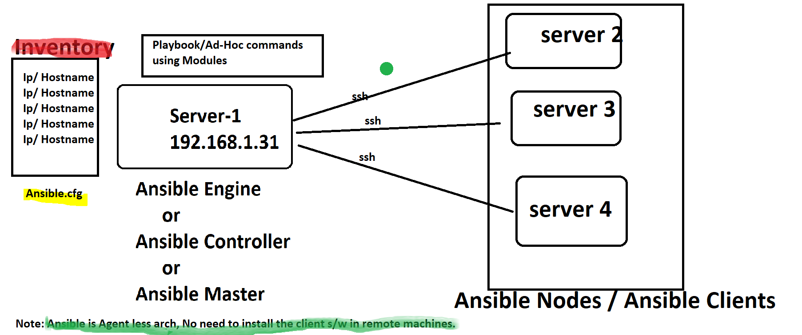

```
Ansible is simple and best.
1. writing play books is very easy. when compared to shell
2. with play books we can automate the tasks with less no of lines.
3. Ansible is an open source autiomation tool. we can download with out buying license.
4. it is very simple to setup and yet powerful.
5. Ansible will be helpful to perform:
    configuration management
    application deployment.
    Task Automation.
    and also IT orchestration.
```
```
```
#   ************ Ansible Architecture *******************
Refer the Below image.

```
```
# *************  Why ansible **************************
```
1. It is a free Open source Automation Tool and simple
2. Using Existing OpenSSH
3. Agent-Less ---> No Need to install any agent onn Ansible Clients / Nodes.
4. Phyton / YAML based.
5. Highly Flexible and Configuration Management of Systems.
6. Custom Modules can be Added if needed.
```
# Ansible Installation 
```
1. Prerequisites for Ansible Engine / Control Node:
RHEL / Centos / Debian / Ubuntu Linux with Python 2 (Version 2.7) or Phyton 3 (versions 3.5 and Higher) Installed
2. Windows isn't supported for the control node.

Note: Ansible version 2.4 and later can manage earlier Operating Systems that contanin Phython 2.6 or higher.

Steps to Install Ansible

1. using Yum
2. using PIP
3. Using Compile File
```
# steps to install ANsible on Centos -7 Using Yum.
```
Open:https://docs.ansible.com/
To install:
First we need to check Phthon installed or not.
# python --version
Python 2.7.5

# yum install ansible
To verifyt the already installed.

yum list | grep ansible
    or 
# rpm -aq ansible
ansible-2.4.2.0-2.el7.noarch
NOte: in the above it was installed to older version of ansible 2.4.2 if you want to install the latest one. Follow below.

In the ansible doc page we have: 
RPMs for currently supported versions of RHEL, CentOS, and Fedora are available from EPEL as well as releases.ansible.com.
 
Click on EPEL --> Extra Packages for Enterprise Linux (EPEL)

    RHEL/CentOS 7:

   # yum install https://dl.fedoraproject.org/pub/epel/epel-release-latest-7.noarch.rpm


# yum install ansible -y
# yum list|grep ansible|grep @
ansible.noarch                          2.9.1-1.el7                    @epel
# rpm -aq ansible
ansible-2.9.1-1.el7.noarch

# ansible --version
ansible 2.9.1
  config file = /etc/ansible/ansible.cfg
  configured module search path = [u'/root/.ansible/plugins/modules', u'/usr/share/ansible/plugins/modules']
  ansible python module location = /usr/lib/python2.7/site-packages/ansible
  executable location = /usr/bin/ansible
  python version = 2.7.5 (default, Aug  7 2019, 00:51:29) [GCC 4.8.5 20150623 (Red Hat 4.8.5-39)]
Note: if we install Ansible with PIP by default we will not able to see the Config file.

Below are the 3 impotant files for Ansible:
# cd /etc/ansible/
[root@server1 ansible]# ls -ltr
total 24
drwxr-xr-x 2 root root     6 Nov 14 09:55 roles
-rw-r--r-- 1 root root  1016 Nov 14 09:55 hosts
-rw-r--r-- 1 root root 19985 Nov 14 09:55 ansible.cfg

Steps to configure Ansible:
1. launch / select required no of servers. Which are called Managed Nodes / Clients.
2. Requirements for managed Nodes / Clients:
        Phthon 2 (version 2.6 or later) or Python 3 (version 3.5 or later)
    Note: We can also work without python on Managed Nodes that is using Raw Modules.
if we have phyton on remote node we can easly run the play books.
if not we can use raw modules with complex.
3. Ansible Engine used SSH Connection to connect and work with managed Nodes.
4. We can Create SSH Connection in two ways:
    1. Password Auth
    2. Password-Less Auth  ( This is with SSH-Keys)
5. Provide the Manage Nodes IP/ FQDN in inventory file on Ansible Engine.
6. Simple test the Configuration by Running : ansible all -m ping

```
# ********** Steps: Password less Authentication ***************
```
Hear i am not using Root to run the play books.
1. Created ansadmin user in master and nodes.
# useradd ansadmin
# passwd ansadmin

2. Provide root privileges to all ansadmin users on all servers.
visudo

## Read drop-in files from /etc/sudoers.d (the # here does not mean a comment)
#includedir /etc/sudoers.d
ansadmin        ALL=(ALL)       NOPASSWD: ALL

3. Make sure that password Authentication yes in all servers under /etc/ssh/sshd_config file.

and restart the serivice if any config changes.
service sshd restart -- on 6
systemctl restart sshd -- on 7

4. Generate ssh-keys using ssh-keygen command from ansadmin

# su - ansadmin
[ansadmin@server1 ~]$ ls -a
.  ..  .bash_logout  .bash_profile  .bashrc  .cache  .config  .mozilla
[ansadmin@server1 ~]$ ssh-keygen
Generating public/private rsa key pair.
Enter file in which to save the key (/home/ansadmin/.ssh/id_rsa):
Created directory '/home/ansadmin/.ssh'.
Enter passphrase (empty for no passphrase):
Enter same passphrase again:
Your identification has been saved in /home/ansadmin/.ssh/id_rsa.
Your public key has been saved in /home/ansadmin/.ssh/id_rsa.pub.
The key fingerprint is:
SHA256:2cQOjq5pWvrKj1HbZjZy1M2x0XVdvIvPXhhncaUQiZc ansadmin@server1.example.com
The key's randomart image is:
+---[RSA 2048]----+
|           .o+..*|
|         ...Eo o+|
|        . =.. ..o|
|       + O +   .o|
|    . o S *   o +|
|   . =       . * |
|  . + O       + .|
| . =.O .       o.|
|  **=         .. |
+----[SHA256]-----+
[ansadmin@server1 ~]$ ls -a
.  ..  .bash_logout  .bash_profile  .bashrc  .cache  .config  .mozilla  .ssh
[ansadmin@server1 ~]$ cd .ssh/
[ansadmin@server1 .ssh]$ ls
id_rsa  id_rsa.pub
[ansadmin@server1 .ssh]$ ssh-copy-id server

similarly copied to destop node also.


Note: if you want to ssh key file to remote nodes, with out pwd and yes promt.

sshpass -f pwd.txt ssh-copy-id -o "StrictHostKeyChecking = no"  hostname/IP


```
