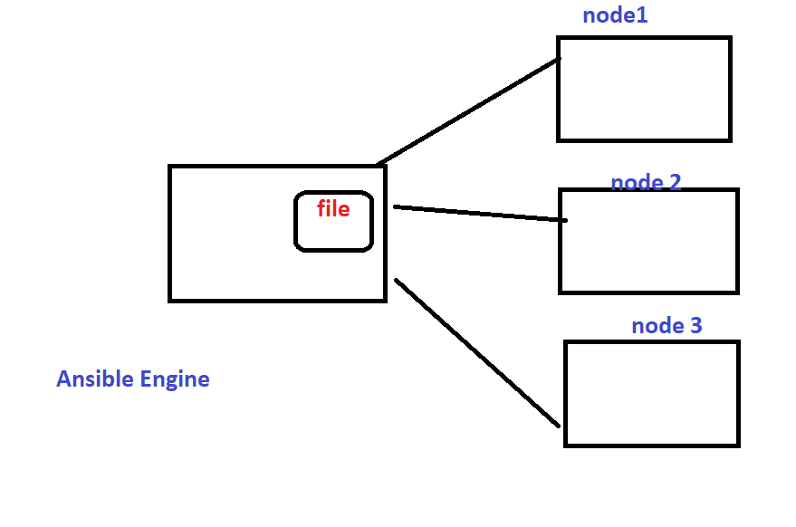

```
Ansible is simple and best.
1. writing play books is very easy. when compared to shell
2. with play books we can automate the tasks with less no of lines.
3. Ansible is an open source autiomation tool. we can download with out buying license.
4. it is very simple to setup and yet powerful.
5. Ansible will be helpful to perform:
    configuration management
    application deployment.
    Task Automation.
    and also IT orchestration.
```
```
```
#   ************ Ansible Architecture *******************
Refer the Below image.

```
```
# *************  Why ansible **************************
```
1. It is a free Open source Automation Tool and simple
2. Using Existing OpenSSH
3. Agent-Less ---> No Need to install any agent onn Ansible Clients / Nodes.
4. Phyton / YAML based.
5. Highly Flexible and Configuration Management of Systems.
6. Custom Modules can be Added if needed.
```
# Ansible Installation 
```
1. Prerequisites for Ansible Engine / Control Node:
RHEL / Centos / Debian / Ubuntu Linux with Python 2 (Version 2.7) or Phyton 3 (versions 3.5 and Higher) Installed
2. Windows isn't supported for the control node.

Note: Ansible version 2.4 and later can manage earlier Operating Systems that contanin Phython 2.6 or higher.

Steps to Install Ansible

1. using Yum
2. using PIP
3. Using Compile File
```
# steps to install ANsible on Centos -7 Using Yum.
```
Open:https://docs.ansible.com/
To install:
First we need to check Phthon installed or not.
# python --version
Python 2.7.5

# yum install ansible
To verifyt the already installed.

yum list | grep ansible
    or 
# rpm -aq ansible
ansible-2.4.2.0-2.el7.noarch
NOte: in the above it was installed to older version of ansible 2.4.2 if you want to install the latest one. Follow below.

In the ansible doc page we have: 
RPMs for currently supported versions of RHEL, CentOS, and Fedora are available from EPEL as well as releases.ansible.com.
 
Click on EPEL --> Extra Packages for Enterprise Linux (EPEL)

    RHEL/CentOS 7:

   # yum install https://dl.fedoraproject.org/pub/epel/epel-release-latest-7.noarch.rpm


# yum install ansible -y
# yum list|grep ansible|grep @
ansible.noarch                          2.9.1-1.el7                    @epel
# rpm -aq ansible
ansible-2.9.1-1.el7.noarch

# ansible --version
ansible 2.9.1
  config file = /etc/ansible/ansible.cfg
  configured module search path = [u'/root/.ansible/plugins/modules', u'/usr/share/ansible/plugins/modules']
  ansible python module location = /usr/lib/python2.7/site-packages/ansible
  executable location = /usr/bin/ansible
  python version = 2.7.5 (default, Aug  7 2019, 00:51:29) [GCC 4.8.5 20150623 (Red Hat 4.8.5-39)]
Note: if we install Ansible with PIP by default we will not able to see the Config file.

Below are the 3 impotant files for Ansible:
# cd /etc/ansible/
[root@server1 ansible]# ls -ltr
total 24
drwxr-xr-x 2 root root     6 Nov 14 09:55 roles
-rw-r--r-- 1 root root  1016 Nov 14 09:55 hosts
-rw-r--r-- 1 root root 19985 Nov 14 09:55 ansible.cfg

Steps to configure Ansible:
1. launch / select required no of servers. Which are called Managed Nodes / Clients.
2. Requirements for managed Nodes / Clients:
        Phthon 2 (version 2.6 or later) or Python 3 (version 3.5 or later)
    Note: We can also work without python on Managed Nodes that is using Raw Modules.
if we have phyton on remote node we can easly run the play books.
if not we can use raw modules with complex.
3. Ansible Engine used SSH Connection to connect and work with managed Nodes.
4. We can Create SSH Connection in two ways:
    1. Password Auth
    2. Password-Less Auth  ( This is with SSH-Keys)
5. Provide the Manage Nodes IP/ FQDN in inventory file on Ansible Engine.
6. Simple test the Configuration by Running : ansible all -m ping

```
# ********** Steps: Password less Authentication ***************
```
Hear i am not using Root to run the play books.
1. Created ansadmin user in master and nodes.
# useradd ansadmin
# passwd ansadmin

2. Provide root privileges to all ansadmin users on all servers.
visudo

## Read drop-in files from /etc/sudoers.d (the # here does not mean a comment)
#includedir /etc/sudoers.d
ansadmin        ALL=(ALL)       NOPASSWD: ALL

3. Make sure that password Authentication yes in all servers under /etc/ssh/sshd_config file.

and restart the serivice if any config changes.
service sshd restart -- on 6
systemctl restart sshd -- on 7

4. Generate ssh-keys using ssh-keygen command from ansadmin

# su - ansadmin
[ansadmin@server1 ~]$ ls -a
.  ..  .bash_logout  .bash_profile  .bashrc  .cache  .config  .mozilla
[ansadmin@server1 ~]$ ssh-keygen
Generating public/private rsa key pair.
Enter file in which to save the key (/home/ansadmin/.ssh/id_rsa):
Created directory '/home/ansadmin/.ssh'.
Enter passphrase (empty for no passphrase):
Enter same passphrase again:
Your identification has been saved in /home/ansadmin/.ssh/id_rsa.
Your public key has been saved in /home/ansadmin/.ssh/id_rsa.pub.
The key fingerprint is:
SHA256:2cQOjq5pWvrKj1HbZjZy1M2x0XVdvIvPXhhncaUQiZc ansadmin@server1.example.com
The key's randomart image is:
+---[RSA 2048]----+
|           .o+..*|
|         ...Eo o+|
|        . =.. ..o|
|       + O +   .o|
|    . o S *   o +|
|   . =       . * |
|  . + O       + .|
| . =.O .       o.|
|  **=         .. |
+----[SHA256]-----+
[ansadmin@server1 ~]$ ls -a
.  ..  .bash_logout  .bash_profile  .bashrc  .cache  .config  .mozilla  .ssh
[ansadmin@server1 ~]$ cd .ssh/
[ansadmin@server1 .ssh]$ ls
id_rsa  id_rsa.pub
[ansadmin@server1 .ssh]$ ssh-copy-id server

similarly copied to destop node also.


Note: if you want to ssh key file to remote nodes, with out pwd and yes promt.

sshpass -f pwd.txt ssh-copy-id -o "StrictHostKeyChecking = no"  hostname/IP

5. Copy ssh public key using ssh-copy-id <hostname> from /home/ansadmin/.ssh location.
6. update inventory file with ip's
    # vim /etc/ansible/hosts
    # tail -2 /etc/ansible/hosts
        192.168.1.29
        192.168.1.30
7. now login to remote server without providing password with the following command.
        ssh user_name@hostname

8. To ping the all the hosts in the inventory.

# ansible all -m ping
192.168.1.30 | SUCCESS => {
    "ansible_facts": {
        "discovered_interpreter_python": "/usr/bin/python"
    }, 
    "changed": false, 
    "ping": "pong"
}
192.168.1.29 | SUCCESS => {
    "ansible_facts": {
        "discovered_interpreter_python": "/usr/bin/python"
    }, 
    "changed": false, 
    "ping": "pong"
}
[ansadmin@server1 ~]$ ansible -m ping all
192.168.1.30 | SUCCESS => {
    "ansible_facts": {
        "discovered_interpreter_python": "/usr/bin/python"
    }, 
    "changed": false, 
    "ping": "pong"
}
192.168.1.29 | SUCCESS => {
    "ansible_facts": {
        "discovered_interpreter_python": "/usr/bin/python"
    }, 
    "changed": false, 
    "ping": "pong"
}

---
```
# Ansible Directory Structure 
```
Default location.

$ tree /etc/ansible/
/etc/ansible/
├── ansible.cfg
├── hosts
└── roles

1 directory, 2 files


$ head -20 /etc/ansible/ansible.cfg | tail

# some basic default values...

#inventory      = /etc/ansible/hosts
#library        = /usr/share/my_modules/
#module_utils   = /usr/share/my_module_utils/
#remote_tmp     = ~/.ansible/tmp
#local_tmp      = ~/.ansible/tmp
#plugin_filters_cfg = /etc/ansible/plugin_filters.yml
#forks          = 5

Note: if you want to create your own hostfile. You need to change the patch in config file.

inventory      = /etc/ansible/myhosts


--
If you want to use  the ansible  location.

$ cp -rpP /etc/ansible/* .
[ansadmin@server1 my_anisble_dir]$ ls
ansible.cfg  hosts  myhosts  roles
[ansadmin@server1 my_anisble_dir]$ pwd
/home/ansadmin/my_anisble_dir

If you want to use the hostfile dynamically as input.

$ cat inv.txt
server
desktop
[ansadmin@server1 my_anisble_dir]$ ansible all -m ping -i inv.txt
server | SUCCESS => {
    "ansible_facts": {
        "discovered_interpreter_python": "/usr/bin/python"
    }, 
    "changed": false, 
    "ping": "pong"
}
desktop | SUCCESS => {
    "ansible_facts": {
        "discovered_interpreter_python": "/usr/bin/python"
    }, 
    "changed": false, 
    "ping": "pong"
}

---
```
# How to Disable the Host key checking.

## If the know host not available we will get the below message.


## while executing the ansible ping also we will get the error.


## if we want to enable the host checking temporily(but this will work only in the existing session, once after the new session. it will ask again).

### export ANSIBLE_HOST_KEY_CHECKING=False

## if we want to enable the host key checking false for all the machines.
### change the config in ansible.cfg file.
host_key_checking = False


```
```
# INVENTORY FILE WITH "GROUPS"  AND "GROUP OF GROUPS"

## The Ansible Inventory file defines the list of hosts, upon which ansible works.
```
Note: Host has to be listed in hostfile, other wise it will not allow.
$ cat myhosts
192.168.1.29
192.168.1.30
#192.168.1.35
[ansadmin@server1 my_ansible_prod]$ ansible 192.168.1.35 -m ping
[WARNING]: Could not match supplied host pattern, ignoring: 192.168.1.35

[WARNING]: No hosts matched, nothing to do


$ cat myhosts
192.168.1.29
192.168.1.30
192.168.1.35

$ ansible 192.168.1.35 -m ping
192.168.1.35 | SUCCESS => {
    "ansible_facts": {:
        "discovered_interpreter_python": "/usr/bin/python"
    }, 
    "changed": false, 
    "ping": "pong"
}

NOte: we can use multihosts,using below syntax.but using this it is difficult to provide ip's for more servers. so that we can use groups.
# ansible ip1:ip2 -m ping

----
Now exchanging the ssh keys to localhost of ansisble engine, just to get one more host.
$ sshpass -f pwd.txt ssh-copy-id -o  "StrictHostKeyChecking = no" localhost
now we can cosider local host alos one of the managed node.

$ cat myhosts
192.168.1.29
192.168.1.30
192.168.1.35
localhost

Now created groups.

$ cat myhosts
[group1]
192.168.1.29
192.168.1.30

[group2]
192.168.1.35
localhost

$ ansible group2 -m ping
localhost | SUCCESS => {
    "ansible_facts": {
        "discovered_interpreter_python": "/usr/bin/python"
    }, 
    "changed": false, 
    "ping": "pong"
}
192.168.1.35 | SUCCESS => {
    "ansible_facts": {
        "discovered_interpreter_python": "/usr/bin/python"
    }, 
    "changed": false, 
    "ping": "pong"
}
--------
To ping multiple groups.
Syntax: ansible group1:group2 -m ping

to ping multiple group on groups.

$ ansible group3 -m ping

$ cat myhosts
[group1]
192.168.1.36
192.168.1.30

[group2]
192.168.1.35
localhost

[group3:children]
group1
group2
------
```
# Ansible    --> ansible.cfg
```
##  the default location is /etc/ansible/ansible/.cfg, in which we can make various settings like.

### 1. location of inventory file
### 2. host_key_checking as False

# but we can define ansible configuration file in different location and for this there is a priority for this files.

# locations with priority (starting from top to bottom):
    1. ANSIBLE_CONFIG environment variable
    2. ./ansible.cfg from the current directory
    3. ~/.ansible.cfg file present in home directory.
    4. /etc/ansible/ansible.cfg default ansible.cfg file.

# Note: ansible will only use the configuration settings from the 
file which is found in this sequence first, it will not look for 
the settings in the higher sequence files if the setting is not 
present in the file which is chosen for deployment.
```

# Ansible Installation:
## 1. yum -- yum intall ansible -- Default locaion : /etc/ansible
## 2. Pip -- pip2 install ansible --None
## 3. make installation 

```
```

# INTRODUCTION TO Ansible Ad-hoc Commands.
```
We can work ansible nodes, in two ways
    1. Ad-hoc Commands
    2. Playbooks
```
```
To get the out of some shell commands in a remote node.
syntax: ansible all -m shell -a "command"
note: -m : module.
      -a : arugument.
for meminfo:
ansible all -m shell -a "free -m"

for resolve file info:
ansible all -m shell -a "cat /etc/resolv.conf"

for uptime :
ansible all -m shell -a "uptime"
192.168.1.35 | CHANGED | rc=0 >>
 07:04:21 up 25 min,  1 user,  load average: 0.00, 0.01, 0.06

192.168.1.30 | CHANGED | rc=0 >>
 07:04:21 up 25 min,  1 user,  load average: 0.01, 0.04, 0.10

192.168.1.36 | CHANGED | rc=0 >>
 07:04:22 up 25 min,  2 users,  load average: 0.01, 0.07, 0.24

localhost | CHANGED | rc=0 >>
 07:04:22 up 26 min,  2 users,  load average: 0.00, 0.12, 0.82
 

 To list all the modules.
 $ ansible-doc -l

 To list all the module with shell.
 $ ansible-doc shell

 To list the total no lines in ansible doc

 $ ansible-doc -l | wc -l
[WARNING]: win_template parsing did not produce documentation.
[WARNING]: template parsing did not produce documentation.
3387

syntax of adhoc commands

$ ansible [-i prod_inv] server_name:group:group2 -m module [-a argument_value]
 ----------

Ansible Architure:

In ansisble once we had executed the it will user .ansible/tmp file and generate the output.

$ tree -al .ansible/
.ansible/
├── cp
└── tmp
    ├── ansible-tmp-1578101055.19-164977329058280
    │   └── AnsiballZ_command.py
    └── ansible-tmp-1578104893.91-272000425290996
        └── AnsiballZ_command.py
it has the that python module.

$ ANSIBLE_KEEP_REMOTE_FILES=1 ansible all -m shell -a "uptime'
Note: to keep the remote files we need to prefix the above parameter.
Ansible engine is pushing the modules to the remote node. 

To know no of hosts connects at a time to execute the tasks
$ cat ansible.cfg | grep fork
#forks          = 5
note: in the above forks are 5, it will execute the taks at a time 5 machnes. if you have 100 nodes, then it will take 100/5 times to complete the tasks.

by default 5 nodes will , evey it is not listed also. based on our requirement, we can change it .

Ansible executes task on Managed nodes paralley.
If you want to execute the in serial then use by keeping forks =  1 in ansible.cfg

Ansible follows push machaism and agent less 
```
# Transfer a file using Ansible Ad-hoc command.


## ansible [-i inventory] <server1:server2:group1:group2> -m module [-a arugument]
```
## $ ansible all -m copy -a "src=ansible_eng.txt dest=/tmp"

# to copy file with differnent name is
$ ansible all -m copy -a "src=ansible_eng.txt dest=/tmp/ans.txt"
192.168.1.35 | CHANGED => {
    "ansible_facts": {
        "discovered_interpreter_python": "/usr/bin/python"
    }, 
    "changed": true, 
    "checksum": "b275fa8e99c7db12421d912eae743be47489aecc", 
    "dest": "/tmp/kpk", 
    "gid": 1001, 
    "group": "ansadmin", 
    "md5sum": "ebbd877d507ab9ca2e2dfcd1e0fd0bd5", 
    "mode": "0664", 
    "owner": "ansadmin", 
    "size": 11, 
    "src": "/home/ansadmin/.ansible/tmp/ansible-tmp-1578274018.51-29471310120004/source", 
    "state": "file", 
    "uid": 1001
}
NOte: changed : true, denotes that the file had been copyed and modified.

In the below i am re-run the same task.now see the difference.
$ ansible all -m copy -a "src=ansiengine.txt dest=/tmp/kpk"
192.168.1.35 | SUCCESS => {
    "ansible_facts": {
        "discovered_interpreter_python": "/usr/bin/python"
    }, 
    "changed": false, 
    "checksum": "b275fa8e99c7db12421d912eae743be47489aecc", 
    "dest": "/tmp/kpk", 
    "gid": 1001, 
    "group": "ansadmin", 
    "mode": "0664", 
    "owner": "ansadmin", 
    "path": "/tmp/kpk", 
    "size": 11, 
    "state": "file", 
    "uid": 1001
}

Note: Hear changed state is false. hear it is already having the same file in destination location.
This is the one of the property of Ansible called "idempotent".

To copy the content with out file name:
$ ansible all -m copy -a "content='ansi eng content' dest=/tmp"
192.168.1.35 | FAILED! => {
    "changed": false, 
    "msg": "can not use content with a dir as dest"
}
Note: It got an error that for content we need to provide the destination file. In the below i am providing the 
destination file.
$ ansible all -m copy -a "content='ansiengine' dest=/tmp/ans.txt"
localhost | CHANGED => {
    "ansible_facts": {
        "discovered_interpreter_python": "/usr/bin/python"
    }, 
    "changed": true, 
    "checksum": "80faa78d1300e71ec8c748e9133925167303e382", 
    "dest": "/tmp/ans.txt", 
    "gid": 1002, 
    "group": "ansadmin", 
    "md5sum": "fa73c02bad8fcf88a97aefcbd701719a", 
    "mode": "0664", 
    "owner": "ansadmin", 
    "size": 10, 
    "src": "/home/ansadmin/.ansible/tmp/ansible-tmp-1578275519.06-237937606998324/source", 
    "state": "file", 
    "uid": 1002

To backup a file, if you alredy having the same file.
$ ansible all -m copy -a "content='ansiengine new' dest=/tmp/ans.txt backup=yes"
localhost | CHANGED => {
    "ansible_facts": {
        "discovered_interpreter_python": "/usr/bin/python"
    }, 
    "backup_file": "/tmp/ans.txt.6816.2020-01-06@07:27:58~", 
    "changed": true, 
    "checksum": "d70b10ca4bc99ba13b07cb9757262a2a07a00ae6", 
    "dest": "/tmp/ans.txt", 
    "gid": 1002, 
    "group": "ansadmin", 
    "md5sum": "e4fc4f0a9679bbb39f25aa62fe590b7f", 
    "mode": "0664", 
    "owner": "ansadmin", 
    "size": 14, 
    "src": "/home/ansadmin/.ansible/tmp/ansible-tmp-1578275869.83-238565252288676/source", 
    "state": "file", 
    "uid": 1002
}

--> similarly for the file:

$ ansible all -m copy -a "src=ansiengine.txt dest=/tmp/ans.txt backup=yes"
localhost | CHANGED => {
    "ansible_facts": {
        "discovered_interpreter_python": "/usr/bin/python"
    }, 
    "backup_file": "/tmp/ans.txt.7592.2020-01-06@07:37:56~", 
    "changed": true, 
    "checksum": "a45d8786abf03b7dbcdfcdcfac84e55bac49fd01", 
    "dest": "/tmp/ans.txt", 
    "gid": 1002, 
    "group": "ansadmin", 
    "md5sum": "5eedb02d1c8e4bff6dffa40632a2fb54", 
    "mode": "0664", 
    "owner": "ansadmin", 
    "size": 12, 
    "src": "/home/ansadmin/.ansible/tmp/ansible-tmp-1578276470.3-259290646804297/source", 
    "state": "file", 
    "uid": 1002
}

$ ls -ltr /tmp | grep ans.txt
-rw-rw-r-- 1 ansadmin ansadmin 10 Jan  6 07:22 ans.txt.6816.2020-01-06@07:27:58~
-rw-rw-r-- 1 ansadmin ansadmin 14 Jan  6 07:27 ans.txt.7592.2020-01-06@07:37:56~
-rw-rw-r-- 1 ansadmin ansadmin 12 Jan  6 07:37 ans.txt


```


# Download a file from Nodes using Ansible Ad-hoc command.
## Download a file using fetch module
## syntax: 
 ## ansible [-i inventory_file] <server1:server2:Group1:group2> -m <module> [-a arguments]
 ## ansible db_servers -m fetch -a "src=/scource/file/path dest=/dest/location"
```
examples: copy files from remote node to ansible engine

$ ansible all -m fetch -a "src=/tmp/myhosts dest=./demo2/"

$ ansible all -m fetch -a "src=/tmp/myhosts dest=./demo2/"
192.168.1.35 | CHANGED => {
    "changed": true, 
    "checksum": "e0b7f6f1f3e929727e606037c9c32d44419f9228", 
    "dest": "/home/ansadmin/my_ansible_Nprod/demo2/192.168.1.35/tmp/myhosts", 
    "md5sum": "42cdc97c8ed2b70c00eab2c6a3c023ea", 
    "remote_checksum": "e0b7f6f1f3e929727e606037c9c32d44419f9228", 
    "remote_md5sum": null
}

$ tree demo2/
demo2/
├── 192.168.1.30
│   └── tmp
│       └── myhosts
├── 192.168.1.35
│   └── tmp
│       └── myhosts
└── localhost
    └── tmp
        └── myhosts

6 directories, 3 files
Note: IN the above file copied from remote node, but it creating the directory structure also.
      To over come this, we need to use the flat. if the content is different we need to use the addition inventory alos.
-------------
Example 2: Now using flat and inventory 

$ ansible all -m fetch -a "src=/tmp/myhosts dest=./newdemo/{{inventory_hostname}}_demo.txt
flat=yes"
192.168.1.35 | CHANGED => {
    "changed": true, 
    "checksum": "e0b7f6f1f3e929727e606037c9c32d44419f9228", 
    "dest": "/home/ansadmin/my_ansible_Nprod/newdemo/192.168.1.35_demo.txt", 
    "md5sum": "42cdc97c8ed2b70c00eab2c6a3c023ea", 
    "remote_checksum": "e0b7f6f1f3e929727e606037c9c32d44419f9228", 
    "remote_md5sum": null
}

$ tree newdemo/
newdemo/
├── 192.168.1.30_demo.txt
├── 192.168.1.35_demo.txt
└── localhost_demo.txt

0 directories, 3 files

```
# Create / Delete a file or Directory using Ansible Ad-hoc command
## using the file module: create and delete file / directory
```
Example: to create a file with name: test.txt in remote nodes.
$ ansible all -m file -a "path=/tmp/test.txt state=touch"

$ ls -ltr /tmp/ | grep test
-rw-rw-r-- 1 ansadmin ansadmin    0 Jan  6 08:57 test.txt

Example: To create a directory in /tmp/newdir in remote nodes.
$ ansible all -m file -a "path=/tmp/newdir state=directory"

$ ls -ltr /tmp/ | grep test
-rw-rw-r-- 1 ansadmin ansadmin    0 Jan  6 08:57 test.txt

Example: To know the othe state values, 
$ ansible all -m file -a "path=/tmp/ll.txt state=dd"

"changed": false, 
    "msg": "value of state must be one of: absent, directory, file, hard, link, touch, got: dd"
---
Example: To delete a file in the remote machine.
$ ansible all -m file -a "path=/tmp/test.txt state=absent"
192.168.1.35 | CHANGED => {
    "ansible_facts": {
        "discovered_interpreter_python": "/usr/bin/python"
    }, 
    "changed": true, 
    "path": "/tmp/test.txt", 
    "state": "absent"
------------
Example : to create a file in root directory. by default it will not allowed.
192.168.1.35 | FAILED! => {
    "ansible_facts": {
        "discovered_interpreter_python": "/usr/bin/python"
    }, 
    "changed": false, 
    "msg": "Error, could not touch target: [Errno 13] Permission denied: '/etc/new.txt'", 
    "path": "/etc/new.txt"
}

Note: to over come this we need to become sudo. we can use -b or --become
$ ansible all -m file -a "path=/etc/new.txt state=touch" -b

To run the command with password
$ ansible all -m file -a "path=/etc/new.txt state=touch" -k

Note: in visudo if you provide the below entry. it will not ask any password while executing the ansible playbook / ad-hoc command -b. if not -k with password 
ansadmin        ALL=(ALL)       NOPASSWD: ALL
*********** if not will get below error.
$ ansible 192.168.1.35 -m file -a "path=/tmp/ans.txt state=touch" -b
192.168.1.35 | FAILED! => {
    "msg": "Missing sudo password"
}

### to list the servers without opening the inventory file.
$ ansible all -m ping --list-hosts
  hosts (4):
    192.168.1.36
    192.168.1.30
    192.168.1.35
    localhost

$ ansible groupa -m ping --list-host
  hosts (2):
    172.31.25.157
    172.31.29.41

----

--
```
# Different Modules to work with files ansible AD-hoc command.

refer files module.

```

```
# install a package ( git ,httpd,mysql,nginx) using Ansible

---
ddddd\d
```


