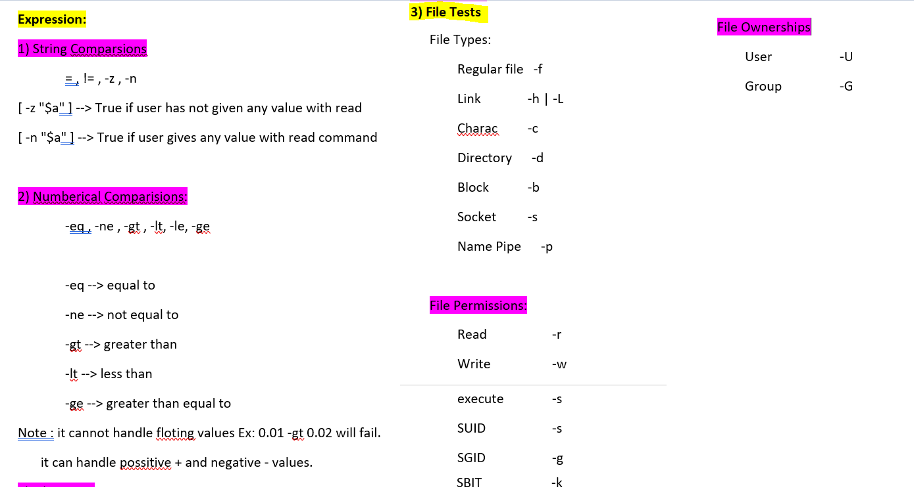

#           ***** SHEBANG *****
```
#!/bin/bash
1) First and formost line - SHEBANG
Shell - Interpreter.
```

#        ***** COMMENTS ******
```
# ANY LINE STARTS WITH # IS CALLED COMMENT AND IF IT IS 1ST LINE THEN IT WILL BE SHEBANG

```

#       ****** PRINTING ******
```
Command-Name {options} {I/P}
echo {options}

-e -Enable Esc Seq
    \n  - New Line
    \t  - New Tab
    \e  - New Color
                    
echo I/P : echo -e "HI \n BYE"
O/P:    HAI
        BYE

Note: When ever you are using -e option in echo command , always provide the input in double  Quotes.

I/P: echo -e " Hi \nBYE"
O/P: HI
     Bye

# echo -e "hi \tbye"
hi      bye

To get the colour informetion man page is
# man console_codes

FG      BG
Black   30      40        
Red     31      41
Green   32      42
Yellow  33      43    
Blue    34      44
Magneta 35      45
cyan    36      46
White   37      47
echo -e "\e[color-codemI/P"

Red colour:
# echo -e "\e[31mHellow world"
Hellow world

Green: 
# echo -e "\e[32mHellow world"
Hellow world

To disable the  colours:
# echo -e "\e[0mHellow world"                                                                 
Hellow world

---- TO DISABLE NEW LINE -----
echo -n option: To disable the new line.

# echo -n "Hi Hellow"
Hi Hellow[root@desktop ~]#
                
                OR

# ls -ltr searchfile testfile &>out
[root@desktop ~]# cat out
ls: cannot access testfile: No such file or directory
-rw-r--r-- 1 root root 14 Dec  8 17:31 searchfile

Case 6: to append the output and error to same file.
# ls -ltr searchfile testfile &>>out
[root@desktop ~]# cat out
ls: cannot access testfile: No such file or directory
-rw-r--r-- 1 root root 14 Dec  8 17:31 searchfile
ls: cannot access testfile: No such file or directory
-rw-r--r-- 1 root root 14 Dec  8 17:31 searchfile

Case 7: To display the output and copy to file.
# cat script1.sh
date
[root@desktop ~]# chmod 755 script1.sh
[root@desktop ~]# ./script1.sh
Sun Dec  8 19:07:54 IST 2019
[root@desktop ~]# ./script1.sh >out
[root@desktop ~]# ./script1.sh | tee out
Sun Dec  8 19:08:18 IST 2019
[root@desktop ~]# cat out
Sun Dec  8 19:08:18 IST 2019

case 8: to append the output using tee -a
# ./script1.sh | tee -a out
Sun Dec  8 19:10:07 IST 2019
[root@desktop ~]# cat out
Sun Dec  8 19:08:18 IST 2019
Sun Dec  8 19:10:07 IST 2019


```

#     *** ReDirectors ***

```
Standard Input (Start):
# mail --help
mail: illegal option -- -
Usage: mail -eiIUdEFntBDNHRVv~ -T FILE -u USER -h hops -r address -s SUBJECT -a FILE -q FILE -f FILE -A ACCOUNT -b USERS -c USERS -S OPTION users

# mail -s "Test Mail" root@localhost
GM
.
EOT

NOte: for sending multiple users we need to use a file. like a template hear Input Redirector, works.

# vim BodyMessage
[root@desktop ~]# cat BodyMessage
Hellow,

How are you Doing

see you.

Thanks,
KPK
[root@desktop ~]# mail -s "TestMail" root@localhost <BodyMessage
[root@desktop ~]# mail
Heirloom Mail version 12.5 7/5/10.  Type ? for help.
"/var/spool/mail/root": 6 messages 2 new
    1 user@localhost.local  Wed Aug 14 08:35 1012/76676 "[abrt] open-vm-tools: vmtoolsd killed by SIGTRAP"
    2 root                  Sun Dec  8 16:34  20/650   "Laptop"
    3 root                  Sun Dec  8 16:38  19/660   "Payment"
    4 root                  Sun Dec  8 16:39  19/625   "Payment Remainder"
>N  5 root                  Sun Dec  8 16:43  18/606   "Test Mail"
 N  6 root                  Sun Dec  8 17:15  25/652   "TestMail"

 ---- Message to Users ----

# wall Machine will be rebooted after 10 minutes
[root@desktop ~]#
Broadcast message from root@desktop.example.com (pts/1) (Sun Dec  8 17:21:10 2019):

Machine will be rebooted after 10 minutes
/* Note: in the above wall message shows to all the users */

[root@desktop ~]# tty
/dev/pts/1
[root@desktop ~]# echo -e "\e[31mMachine will be rebooted after 10 minutes\e[0m">/dev/pts/1
Machine will be rebooted after 10 minutes
/* Note: Hear this message will be redirected to terminal 1 */
[root@desktop ~]# echo -e "\e[31mMachine will be rebooted aafter 10 minutes\e[0m">/dev/pts/2
/* Note: Hear this message will be redirected to terminal 2 */

Note: all the commands wont accepts standard inputs.

Ex 1: 
NOte: Grep commnad works for the standard input
# grep root /etc/passwd
root:x:0:0:root:/root:/bin/bash
operator:x:11:0:operator:/root:/sbin/nologin
[root@desktop ~]# grep root</etc/passwd
root:x:0:0:root:/root:/bin/bash
operator:x:11:0:operator:/root:/sbin/nologin

Ex 2:
# rm -f <searchfile
# ls searchfile
searchfile
NOte: hear rm command will not accept the input.

Standard Input (End)..

---------- Standard OUtput --------------
Case 1: 
It will redirect the output.
# date > out
[root@desktop ~]# cat out
Sun Dec  8 17:40:30 IST 2019

Case 2: hear lss is not a command,error not redirected.
# lss >out
bash: lss: command not found...
Similar command is: 'ls'
[root@desktop ~]# cat out
[root@desktop ~]#

Case 3: To redirect erros to a file.
# lss 2>err
[root@desktop ~]# cat err
bash: lss: command not found...
Similar command is: 'ls'

Case 4: Hear we had done that output --> re-directed to out file and error --> redirected to err file

# ls -l searchfile testfile
ls: cannot access testfile: No such file or directory
-rw-r--r-- 1 root root 14 Dec  8 17:31 searchfile
[root@desktop ~]# ls -l searchfile testfile 1>out 2>err
[root@desktop ~]# cat out
-rw-r--r-- 1 root root 14 Dec  8 17:31 searchfile
[root@desktop ~]# cat err
ls: cannot access testfile: No such file or directory

Note: 1> or > is same.

** Case 5: ** hear output and error copied to same file.
# ls searchfile testfile >out 2>&1 or ls -ltr searchfile testdoc &>out
[root@desktop ~]# cat out
ls: cannot access testfile: No such file or directory
searchfile

case 6: Hear output redirected and appended to file.
# ./script1.sh | tee out
Sun Dec  8 19:08:18 IST 2019
[root@desktop ~]# cat out
Sun Dec  8 19:08:18 IST 2019
[root@desktop ~]# ./script1.sh | tee -a out
Sun Dec  8 19:10:07 IST 2019
[root@desktop ~]# cat out
Sun Dec  8 19:08:18 IST 2019
Sun Dec  8 19:10:07 IST 2019
```

#           ****    PIPES   ****


```

 command1 > out ---> Hear it will save the output which utilizes Storage
 command  < out ---> Hear it will utilize the input form file which also utilzes the storage

When comming to pipes, i will utilize the ram and very faster than disk.

Pipes - Symbol - |

# cat /etc/passwd | grep root
root:x:0:0:root:/root:/bin/bash
operator:x:11:0:operator:/root:/sbin/nologin
```
#           ***** Exit Status *****

```

# ls >/dev/null
[root@desktop ~]# echo $?
0
[root@desktop ~]# lss &>/dev/null

Note: Hear /dev/null --> it will nullify the output.
[root@desktop ~]# echo $?
127
[root@desktop ~]# sleep 400
╚
[root@desktop ~]# echo $?
130

----
# cat script1.sh
date
echo "Message1"
exit
echo "Message2"
[root@desktop ~]# chmod +x script1.sh
[root@desktop ~]# ./script1.sh
Sun Dec  8 22:17:51 IST 2019
Message1
[root@desktop ~]# echo $?
0

----
# cat script1.sh
date
echo "Message1"
exit 1
echo "Message2"
[root@desktop ~]# ./script1.sh
Sun Dec  8 22:19:41 IST 2019
Message1
[root@desktop ~]# echo $?
1
Note: Hear we Had exproted the exit status 1 in script

Importance of exit status:
IN this example one command is exited but it will not stoped, it continued to execute the next command.
Example:
# cat exit_test.sh
#!/bin/bash
echo Hai
eeho Hello
echo bye
[root@desktop ~]# chmod +x exit_test.sh
[root@desktop ~]# ./exit_test.sh
Hai
./exit_test.sh: line 3: eeho: command not found
bye

NOte: hear exit status will helps.
```
# ***** Quotes ****************
```
Meta-Characters: 
a-z,0-9,_ (Normal characters)
~!@#$%^&*() (Special Character) space
        1) Backslash (\) -- to disable to special characers, But it is difficult to apply for every character.
        2) Single Quotes ('') -- It will completely disable the special charactes.
        3) Double Quotes (" ")-- It will treat only Dollar ($) and Command Quotes(``) as special character. 
        Again if you want to disable the special character we need to use \$  \`.
        ---------------------------------------------------------------
        1) BackSlach(\) --- it will escape the special character.

        # echo *
        CentOS-7-x86_64-DVD-1810.iso etc_bkp etc_bkp1 passwd SampleWebApp.war Testfile1.txt Testfile.txt
        
        # echo \*
        *

        # echo $$
        17514
        [root@desktop Desktop]# echo \$\$
        $$
        [root@desktop Desktop]# echo \* \$\$
        * $$
        -------------------------------------------------------------------------
        2) Single Quotes('')
        # cat script3.sh
        #!/bin/bash
        echo 'Today Date is `date`'

        [root@desktop Desktop]# ./script3.sh
        Today Date is `date`
        [root@desktop Desktop]# vim script3.sh
        [root@desktop Desktop]# ./script3.sh
        Today Date is Sun Dec  8 23:08:24 IST 2019
        [root@desktop Desktop]# cat script3.sh
        #!/bin/bash
        echo "Today Date is `date`"
        Note: `` is command qutoes
        
        -----
        # echo "the status of prvious command = $?"
        the status of prvious command = 0
        [root@desktop Desktop]# echo 'the status of prvious command = $?'
        the status of prvious command = $?
        [root@desktop Desktop]# echo "the status of prvious command = `$?`"
        bash: 0: command not found...
        the status of prvious command =
        -----------------------------------------------
        # echo '$$'="$$"
        $$=17514
        -----------------------------------------------
        # echo a                            b
        a b
        [root@desktop Desktop]# echo 'a                           b'
        a                           b
        [root@desktop Desktop]# echo "a                           b"
        a                           b
        3) Double quotes
        It is alos covered in the above. Please refer.
```
# ****** Text Filters ***********


```
Why ?
hear everthing is a file.
To deal with file, need to sort of data,based on requirement.

Filters:
    1) Line Numbers : head, tail
    2) Row Based    : grep ( -c count,-e multiple words,-f search list from file,-v, invert search,-y or -i ignore case sensitive,-l files with match, -L files without match,-h matched output,-w to search with exact word , -x only that pattern, -q quite it will not show the output.we need to check from exit status, -q -s quite output wit out errors or $>/dev/null we need to check from exit status, -R to serach word in folder),sort,uniq
    3) Coloum Based : cut (default delimter is \t),awk ( default delimitor space),SED

1)Head: 
By default it will display 10 lines

# cat -n passwd | head
     1  root:x:0:0:root:/root:/bin/bash
     2  bin:x:1:1:bin:/bin:/sbin/nologin
     3  daemon:x:2:2:daemon:/sbin:/sbin/nologin
     4  adm:x:3:4:adm:/var/adm:/sbin/nologin
     5  lp:x:4:7:lp:/var/spool/lpd:/sbin/nologin
     6  sync:x:5:0:sync:/sbin:/bin/sync
     7  shutdown:x:6:0:shutdown:/sbin:/sbin/shutdown
     8  halt:x:7:0:halt:/sbin:/sbin/halt
     9  mail:x:8:12:mail:/var/spool/mail:/sbin/nologin
    10  operator:x:11:0:operator:/root:/sbin/nologin

To display top 3 lines # head -n3 <file name> or as below.
# cat -n passwd | head -n3
     1  root:x:0:0:root:/root:/bin/bash
     2  bin:x:1:1:bin:/bin:/sbin/nologin
     3  daemon:x:2:2:daemon:/sbin:/sbin/nologin


2) Tail: 
# cat -n passwd | tail
    41  ntp:x:38:38::/etc/ntp:/sbin/nologin
    42  tcpdump:x:72:72::/:/sbin/nologin
    43  student:x:1000:1000:student:/home/student:/bin/bash
    44  vboxadd:x:988:1::/var/run/vboxadd:/bin/false
    45  tom:x:1001:1001::/home/tom:/bin/bash
    46  nscd:x:28:28:NSCD Daemon:/:/sbin/nologin
    47  nslcd:x:65:55:LDAP Client User:/:/sbin/nologin
    48  tom1:x:1002:1002::/home/tom1:/bin/bash
    49  tom2:x:1003:1002::/home/tom2:/bin/bash
    50  apache:x:48:48:Apache:/usr/share/httpd:/sbin/nologin

To display last 3 lines
# cat -n passwd | tail -n3
    48  tom1:x:1002:1002::/home/tom1:/bin/bash
    49  tom2:x:1003:1002::/home/tom2:/bin/bash
    50  apache:x:48:48:Apache:/usr/share/httpd:/sbin/nologin


Lines between 10 to 15:

# cat -n passwd |head -n15|tail -n6
    10  operator:x:11:0:operator:/root:/sbin/nologin
    11  games:x:12:100:games:/usr/games:/sbin/nologin
    12  ftp:x:14:50:FTP User:/var/ftp:/sbin/nologin
    13  nobody:x:99:99:Nobody:/:/sbin/nologin
    14  systemd-network:x:192:192:systemd Network Management:/:/sbin/nologin
    15  dbus:x:81:81:System message bus:/:/sbin/nologin
----------------------------------------------------------------------
3) Grep: to search words from a file. 

To search a word root from the file passwd
# grep root passwd
root:x:0:0:root:/root:/bin/bash
operator:x:11:0:operator:/root:/sbin/nologin

To invert the search : list the line words which is not "root" in passwd file.
# grep -v root passwd

To search with the word root and ssh
# grep -e root -e ssh passwd
root:x:0:0:root:/root:/bin/bash
operator:x:11:0:operator:/root:/sbin/nologin
sshd:x:74:74:Privilege-separated SSH:/var/empty/sshd:/sbin/nologin

To search words from a file input.
# grep -f search.grep passwd
root:x:0:0:root:/root:/bin/bash
operator:x:11:0:operator:/root:/sbin/nologin
sshd:x:74:74:Privilege-separated SSH:/var/empty/sshd:/sbin/nologin

# cat search.grep
root
ssh

To search words from a file and show the no of lines which is matched.
# grep -f search.grep passwd -c
3

To search a root word from multiple files.

# grep root /etc/passwd /etc/passwd- /etc/group /etc/group- /etc/shadow /etc/shadow-
/etc/passwd:root:x:0:0:root:/root:/bin/bash
/etc/passwd:operator:x:11:0:operator:/root:/sbin/nologin
/etc/passwd-:root:x:0:0:root:/root:/bin/bash
/etc/passwd-:operator:x:11:0:operator:/root:/sbin/nologin
/etc/group:root:x:0:
/etc/group-:root:x:0:
/etc/shadow:root:$6$2qXWJx6j$P2Mm.8XSI.Fb8r9HJEqbvIf5MPdW9xZqY1VbLDeWfVYps4dMEw79pse/botqzBOw7Da8evGsz0JWim5eQu1Fa.:18144:0:99999:7:::
/etc/shadow-:root:$6$2qXWJx6j$P2Mm.8XSI.Fb8r9HJEqbvIf5MPdW9xZqY1VbLDeWfVYps4dMEw79pse/botqzBOw7Da8evGsz0JWim5eQu1Fa.:18144:0:99999:7:::

To search a word from file input in different files.

# grep -f search.grep /etc/passwd /etc/shadow
/etc/passwd:root:x:0:0:root:/root:/bin/bash
/etc/passwd:operator:x:11:0:operator:/root:/sbin/nologin
/etc/passwd:sshd:x:74:74:Privilege-separated SSH:/var/empty/sshd:/sbin/nologin
/etc/shadow:root:$6$2qXWJx6j$P2Mm.8XSI.Fb8r9HJEqbvIf5MPdW9xZqY1VbLDeWfVYps4dMEw79pse/botqzBOw7Da8evGsz0JWim5eQu1Fa.:18144:0:99999:7:::
/etc/shadow:sshd:!!:18122::::::

To search a word and list the words which are matched with out output.
# grep -f search.grep /etc/passwd /etc/shadow -l 
/etc/passwd
/etc/shadow

To search a word and list the words which are matched with out output.
# grep -f search.grep /etc/passwd /etc/shadow /etc/hosts -L
/etc/hosts


To search a word and list the words which are matched with count.
# grep -f search.grep /etc/passwd /etc/shadow -c
/etc/passwd:3
/etc/shadow:2

To grep the file get the output with out file name.
# grep root /etc/passwd /etc/shadow /etc/hosts -h
root:x:0:0:root:/root:/bin/bash
operator:x:11:0:operator:/root:/sbin/nologin
root:$6$2qXWJx6j$P2Mm.8XSI.Fb8r9HJEqbvIf5MPdW9xZqY1VbLDeWfVYps4dMEw79pse/botqzBOw7Da8evGsz0JWim5eQu1Fa.:18144:0:99999:7:::


To grep the files with some text 
# cat -n text
     1  abc
     2  ABC
     3  abcE
     4  XadcX
     5  ABCAAAA
[root@desktop Desktop]# cat -n text | grep abc
     1  abc
     3  abcE
[root@desktop Desktop]# cat -n text | grep -i abc
     1  abc
     2  ABC
     3  abcE
     5  ABCAAAA

To get the only the lines text abc matched.
# cat -n text | grep abc -w
     1  abc
To get the only lines with starting abc
# grep ^abc text
abc
abcE

To get the exact pattern : we need to use -x in that line
# cat text
abc
ABC
abcE
XadcX
ABCAAAA
[root@desktop Desktop]# grep abc text -x
abc
[root@desktop Desktop]# grep abc text -x -i
abc
ABC
[root@desktop Desktop]#

To grep the file and list lines after the lines also. using "-A n"
# cat -n passwd | grep root -A 1
     1  root:x:0:0:root:/root:/bin/bash
     2  bin:x:1:1:bin:/bin:/sbin/nologin
--
    10  operator:x:11:0:operator:/root:/sbin/nologin
    11  games:x:12:100:games:/usr/games:/sbin/nologin
[root@desktop Desktop]# cat -n passwd | grep root -A 2
     1  root:x:0:0:root:/root:/bin/bash
     2  bin:x:1:1:bin:/bin:/sbin/nologin
     3  daemon:x:2:2:daemon:/sbin:/sbin/nologin
--
    10  operator:x:11:0:operator:/root:/sbin/nologin
    11  games:x:12:100:games:/usr/games:/sbin/nologin
    12  ftp:x:14:50:FTP User:/var/ftp:/sbin/nologin

To get the before lines . -B n

# cat -n passwd | grep root -B 1
     1  root:x:0:0:root:/root:/bin/bash
--
     9  mail:x:8:12:mail:/var/spool/mail:/sbin/nologin
    10  operator:x:11:0:operator:/root:/sbin/nologin

To verify the end of the line observe te $ symbol.
    # cat -A passwd |head
root:x:0:0:root:/root:/bin/bash$
bin:x:1:1:bin:/bin:/sbin/nologin$
daemon:x:2:2:daemon:/sbin:/sbin/nologin$
adm:x:3:4:adm:/var/adm:/sbin/nologin$
lp:x:4:7:lp:/var/spool/lpd:/sbin/nologin$
sync:x:5:0:sync:/sbin:/bin/sync$
shutdown:x:6:0:shutdown:/sbin:/sbin/shutdown$
halt:x:7:0:halt:/sbin:/sbin/halt$
mail:x:8:12:mail:/var/spool/mail:/sbin/nologin$
operator:x:11:0:operator:/root:/sbin/nologin$

# grep abc text
abc
abcE
XabcX
123abc
345 abc
[root@desktop Desktop]# grep ^abc text
abc
abcE
[root@desktop Desktop]# grep abc$ text
abc
123abc
345 abc

To grep the words starting with abc , hear ^ denotes the starting of the line, $ denotes the end of the line
# grep abc text
abc
abcE
XabcX
123abc
345 abc
[root@desktop Desktop]# grep ^abc text
abc
abcE
[root@desktop Desktop]# grep abc$ text
abc
123abc
345 abc

# cat -n text
     1  abc
     2  ABC
     3
     4  abcE
     5  XabcX
     6
     7  ABCAAAA
     8
     9  123abc
    10
    11  345 abc

To search the empty lines in text file.
[root@desktop Desktop]# grep ^$ text


To grep the file and delete the empty lines. ^$ is denotes the empty lines -v invert search
[root@desktop Desktop]# grep ^$ text -v
abc
ABC
abcE
XabcX
ABCAAAA
123abc
345 abc


To search a word in a folder insterd of file we need to use -R option.
# grep root /etc -R

To search a word in a folder insted of file we need to usr -R option and -s option to ignore errors or &>/dev/null and -w to exact word 

# grep root /etc -R -s -w


---------------------------------
Sort: To sort text, numbers..

# echo ' 12
23
43
12
56
78
34
65
34
100
32
23
6' | sort -n | uniq
6
12
 12
23
32
34
43
56
65
78
100

CUT: In cut command Default delimiter is \t

# echo -e "1\t2\t3\n4\t5\t6\n7\t8\t9"
1       2       3
4       5       6
7       8       9
[root@desktop /]# echo -e "1\t2\t3\n4\t5\t6\n7\t8\t9" | cut -f1
1
4
7
[root@desktop /]# echo -e "1\t2\t3\n4\t5\t6\n7\t8\t9" | cut -f3
3
6
9

To cut the field 1 and 3:
# echo -e "1\t2\t3\n4\t5\t6\n7\t8\t9" | cut -f1,3
1       3
4       6
7       9

To get the field 2 to last field:
[root@desktop /]# echo -e "1\t2\t3\n4\t5\t6\n7\t8\t9" | cut -f2-  
                                    or
                  echo -e "1\t2\t3\n4\t5\t6\n7\t8\t9" | cut -f2-$NF  
2       3
5       6
8       9

The to use the delimiter using the common value -d :
# cut -d : -f1 passwd |head
root
bin
daemon
adm
lp
sync
shutdown
halt
mail
operator


# cut -d : -f5-$NF passwd | head -2
root:/root:/bin/bash
bin:/bin:/sbin/nologin

# cut -d : -f1,3 passwd | head -2
root:0
bin:1

# cut -d : -f1-3 passwd | head -2
root:x:0
bin:x:1

To cut the characters in a text:
# echo "redhat" | cut -c 1-3
red
[root@desktop Desktop]# echo "redhat" | cut -c 2-
edhat
[root@desktop Desktop]# echo "redhat" | cut -c 2-$NF
edhat
[root@desktop Desktop]# echo "redhat" | cut -c 3-$NF
dhat

Cut will not work in we have unformated spaces. Let see in the below.
# free -m
              total        used        free      shared  buff/cache   available
Mem:           3789        1200         319          42        2269        2258
Swap:          3275           0        3275

# free -m | cut -f7
              total        used        free      shared  buff/cache   available
Mem:           3789        1200         318          42        2269        2258
Swap:          3275           0        3275
Note: it is failed due to unformated spaces, spaces are not uniform. To overcome this we need to use awk.

AWK: Default delimiter is 1.single space,2.multiple spaces,3.Tab space all to gether as default delimite.
        Syntax: awk {options} '{awk-internal commands}' file|stdin
                 Option : -F --> delimiter
# free -m |grep ^Mem| awk '{print $7}'
2255
[root@desktop Desktop]# echo -e "a b   c     d\t\t\te\tf"
a b   c     d                   e       f
[root@desktop Desktop]# echo -e "a b   c     d\t\t\te\tf"|cut -f1
a b   c     d
[root@desktop Desktop]# echo -e "a b   c     d\t\t\te\tf"|cut -f3

[root@desktop Desktop]# echo -e "a b   c     d\t\t\te\tf"|awk '{print $1}'
a
[root@desktop Desktop]# echo -e "a b   c     d\t\t\te\tf"|awk '{print $2}'
b
[root@desktop Desktop]# echo -e "a b   c     d\t\t\te\tf"|awk '{print $4}'
d

# free -m | awk  '/Mem/{print $(NF-1),$NF}'
2270 2253
[root@desktop Desktop]# awk '/root/{print}
>
[root@desktop Desktop]# awk '/root/{print}' passwd
root:x:0:0:root:/root:/bin/bash
operator:x:11:0:operator:/root:/sbin/nologin
[root@desktop Desktop]# awk '/root/{print $NF}' passwd
root:x:0:0:root:/root:/bin/bash
operator:x:11:0:operator:/root:/sbin/nologin
[root@desktop Desktop]# awk -F : '/root/{print $NF}' passwd
/bin/bash
/sbin/nologin
[root@desktop Desktop]# awk -F : '/root/{print $(NF-1)}' passwd
/root
/root
[root@desktop Desktop]# awk -F : '/root/{print $(NF-1)",",$NF}' passwd
/root, /bin/bash
/root, /sbin/nologin
[root@desktop Desktop]# awk -F : '/root/{print $(NF-1)","$NF}' passwd
/root,/bin/bash
/root,/sbin/nologin
[root@desktop Desktop]# awk -F : '/root/{print $(NF-1)","$NF}' passwd
/root,/bin/bash
/root,/sbin/nologin

------------------------------------------------------------------


SED: Stream Line Editor.
sed {options} {sed-commands} Inputs

Commands:
p - print
d - delete
s - substute
i - insert
a - append
c - change
Note: in sed command by default with 'p' option it will be display the duplicates.
To remove the duplicates we need to use  -n option before 'p'
# sed 'p' employee.txt | head -4
101,John Doe,CEO
101,John Doe,CEO
102,Jason Smith,IT Manager
102,Jason Smith,IT Manager

To remove the dupliates.
# sed -n 'p' employee.txt | head -4
101,John Doe,CEO
102,Jason Smith,IT Manager
103,Raj Reddy,Sysadmin
104,Anand Ram,Developer

To Search a String :
# sed -n '/CEO/ p' employee.txt
101,John Doe,CEO

To Search a multiple strings:
# sed -n -e '/CEO/ p' -e '/Manager/ p' employee.txt
101,John Doe,CEO
102,Jason Smith,IT Manager
105,Jane Miller,Sales Manager
106,Stuart Gant,HR Manager

# cat search.sed
/John/ p
/Jane/ p
[root@desktop Desktop]# sed -n -f search.sed employee.txt
101,John Doe,CEO
105,Jane Miller,Sales Manager

To print range of lines.

# sed -n '1,2 p' employee.txt
101,John Doe,CEO
102,Jason Smith,IT Manager
[root@desktop Desktop]# sed -n '1,4 p' employee.txt
101,John Doe,CEO
102,Jason Smith,IT Manager
103,Raj Reddy,Sysadmin
104,Anand Ram,Developer
[root@desktop Desktop]#

Print from line 2 through the last line.
# sed -n '2,$ p' employee.txt
102,Jason Smith,IT Manager
103,Raj Reddy,Sysadmin
104,Anand Ram,Developer
105,Jane Miller,Sales Manager
106,Stuart Gant,HR Manager
107,Damon Stones,Practice Director

To print Odd number lines.
# sed -n '1~2 p' employee.txt
101,John Doe,CEO
103,Raj Reddy,Sysadmin
105,Jane Miller,Sales Manager
107,Damon Stones,Practice Director


Print lines starting from the 1st match of Jason until the 4th Line.
# sed -n '/Jason/,4 p' employee.txt
102,Jason Smith,IT Manager
103,Raj Reddy,Sysadmin
104,Anand Ram,Developer


To print lines starting from the 1st match of Raj to Last line.
# sed -n '/Raj/,$ p' employee.txt
103,Raj Reddy,Sysadmin
104,Anand Ram,Developer
105,Jane Miller,Sales Manager
106,Stuart Gant,HR Manager
107,Damon Stones,Practice Director

Print lines starting fro the line Matching Raj untill the line matching Jane:
# sed -n '/Raj/,/Jane/ p' employee.txt
103,Raj Reddy,Sysadmin
104,Anand Ram,Developer
105,Jane Miller,Sales Manager
Note: if first conditon it will never check for next condition, if Raj is not available then Jane will not print.
If Raj is available and Jane is not available, then it will print Raj to Last line.Just observe the below output.

# sed -n '/Raj/,/sys/ p' employee.txt
103,Raj Reddy,Sysadmin
104,Anand Ram,Developer
105,Jane Miller,Sales Manager
106,Stuart Gant,HR Manager
107,Damon Stones,Practice Director

Print the line matching Raj and 2 lines immediately after that.
# sed -n '/Raj/,+2 p' employee.txt
103,Raj Reddy,Sysadmin
104,Anand Ram,Developer
105,Jane Miller,Sales Manager

To delete 2nd line in file.
# sed -i '2 d' emp
[root@desktop Desktop]# cat emp
101,John Doe,CEO
103,Raj Reddy,Sysadmin
104,Anand Ram,Developer
105,Jane Miller,Sales Manager
106,Stuart Gant,HR Manager
107,Damon Stones,Practice Director

To delete from line 1 through 4
# sed '1,4 d' emp
105,Jane Miller,Sales Manager
106,Stuart Gant,HR Manager
107,Damon Stones,Practice Director

To delete the ODD number of Lines.
# sed '1~2 d' emp
102,Jason Smith,IT Manager
104,Anand Ram,Developer
106,Stuart Gant,HR Manager

To delete the Even number of lines.
# sed '2~2 d' emp
101,John Doe,CEO
103,Raj Reddy,Sysadmin
105,Jane Miller,Sales Manager
107,Damon Stones,Practice Director

To search a word and delete a line.
# sed '/Manager/ d' emp
101,John Doe,CEO
103,Raj Reddy,Sysadmin
104,Anand Ram,Developer
107,Damon Stones,Practice Director

To search a word with out case sensitive and delete the line.
# sed '/Manager/ d' emp
101,John Doe,CEO
103,Raj Reddy,Sysadmin
104,Anand Ram,Developer
107,Damon Stones,Practice Director

To search # sed '/Jason/,4 d' emp
101,John Doe,CEO
105,Jane Miller,Sales Manager
106,Stuart Gant,HR Manager
107,Damon Stones,Practice Directora word Jason and delete upto line 4:

To search a word and delete upto last line.
# sed '/Jason/,$ d' emp
101,John Doe,CEO

To search a word and delete after 2 lines.
# sed '/Jason/,+2 d' emp
101,John Doe,CEO
105,Jane Miller,Sales Manager
106,Stuart Gant,HR Manager
107,Damon Stones,Practice Director

To search and delete empty lines.
# sed '/^$/ d' emp
101,John Doe,CEO
102,Jason Smith,IT Manager
103,Raj Reddy,Sysadmin
104,Anand Ram,Developer
105,Jane Miller,Sales Manager
106,Stuart Gant,HR Manager
107,Damon Stones,Practice Director

Search and replace:
# sed 's/Manager/Devops/' emp
101,John Doe,CEO
102,Jason Smith,IT Devops
103,Raj Reddy,Sysadmin
104,Anand Ram,Developer
105,Jane Miller,Sales Devops
106,Stuart Gant,HR Devops
107,Damon Stones,Practice Director

Search with empno and replace manager as Devops.
# sed '/105/s/Manager/Devops/' emp
101,John Doe,CEO
102,Jason Smith,IT Manager
103,Raj Reddy,Sysadmin
104,Anand Ram,Developer
105,Jane Miller,Sales Devops
106,Stuart Gant,HR Manager
107,Damon Stones,Practice Director

To search a word and replace with othper word.
# echo 'apple ant' | sed 's/a/A/'
Apple ant
To search a word and replace globally
# echo 'apple ant' |sed 's/a/A/g'
Apple Ant
[root@desktop Desktop]# echo 'apple ant' |sed 's/a/A/g'

To replace the first occurance of a to A
# echo 'apple ant' | sed 's/a/A/1'
Apple ant

To replace the second occurance of a to A
# echo 'apple ant' | sed 's/a/A/1'
Apple ant
[root@desktop Desktop]# echo 'apple ant' | sed 's/a/A/2'
apple Ant

to Search with lower case and replce with caps.
# sed 's/ceo/ceoCAP/ig' emp
101,John Doe,ceoCAP
102,Jason Smith,IT Manager
103,Raj Reddy,Sysadmin
104,Anand Ram,Developer
105,Jane Miller,Sales Manager
106,Stuart Gant,HR Manager
107,Damon Stones,Practice Director

note /i is caseinsetive flags, /g is glogal flag
----------
APPEND: to append the data
# sed '2 a hellow,everyone' emp
101,John Doe,CEO
102,Jason Smith,IT Manager
hellow,everyone
103,Raj Reddy,Sysadmin
104,Anand Ram,Developer
105,Jane Miller,Sales Manager
106,Stuart Gant,HR Manager
107,Damon Stones,Practice Director

To append a line on the last line.
# sed '$ a new line' emp
101,John Doe,CEO
102,Jason Smith,IT Manager
hellowddd,everyone
hellowddd,everyone
103,Raj Reddy,Sysadmin
104,Anand Ram,Developer
105,Jane Miller,Sales Manager
106,Stuart Gant,HR Manager
107,Damon Stones,Practice Director
new line

Insert: it will inset the data in line ,if we want to insert in line 1.
# sed '1 i newline' emp
newline
101,John Doe,CEO
102,Jason Smith,IT Manager
hellowddd,everyone
hellowddd,everyone
103,Raj Reddy,Sysadmin
104,Anand Ram,Developer
105,Jane Miller,Sales Manager
106,Stuart Gant,HR Manager
107,Damon Stones,Practice Director


--- 
Change: to delete the record at the line 2 and replace with a new record.
# sed '2 c New line' emp
101,John Doe,CEO
New line
hellowddd,everyone
hellowddd,everyone
103,Raj Reddy,Sysadmin
104,Anand Ram,Developer
105,Jane Miller,Sales Manager
106,Stuart Gant,HR Manager
107,Damon Stones,Practice Director

# sed 's/22/355/' sshd_config | grep 355
#Port 355

# sed 's/#Port 22/Port 355/' sshd_config | grep 355
Port 355

To change the value #  X11Forward to X11 with out hash
# sed -i '/X11Forwarding no/ c X11Forwarding no' sshd_config
```
#     ************ Variable **************************


## variable is nothing but, If you assign a name to set of data.
```
In Bash Variable Name = data
var=data
DATE='12-12-2019'

To access the variable
$Variable_Name
$DATE

To get the content:
echo $DATE

variables will be stored in ram, if we close the terminal the variables also removed.

To remove variable we need to use unset command.
# echo $DATE
12-12-2019
[root@desktop /]# unset DATE  --> overwriting the value with null value.
[root@desktop /]# echo $DATE

Properties of Variable: when ever we creat a variable, it will get some properties.
    1) Readwrite ---> it will allows to over write.
                     to over come this we need to use "readonly variable", to remove the read only we need to close the shell. even root user also unset the variable or overwrite the variable.
    2) Local:   --->A variable declared as local is one that is visible only within the block of code in which it appears. It has local "scope". In a function, a local variable has meaning only within that function block
    Example: 
    # cat script3.sh
    a=10
    echo $a
    [root@desktop /]# ./script3.sh
    10
    [root@desktop /]# echo $a

    [root@desktop /]#
    
    ---
     . or souce are shell bilt in cmd, this will not different pid 

     # echo $c

[root@desktop Desktop]# cat script4.sh
c=10
export c
[root@desktop Desktop]# . script4.sh
[root@desktop Desktop]# echo $c
10
Note: but this will works temporaly , if shell session closed. this will removed.

To make it persistant we need to add in bash_profile file.
    1. vim .bash_profile
    2. got to last line and type ". /root/Desktop/script4.sh"
    3. save and exit
by using the above steps when ever you login to the machie with any shell, it will be accetpt the varibles.


    3) Scalar -->arrays

    # class[0]=lkg
[root@desktop ~]# class[1]=ukg
[root@desktop ~]# class[2]=1stclass
[root@desktop ~]# class[3]=2ndclass

# echo ${class[2]}
1stclass

# echo ${class[2]}
1stclass


[root@desktop ~]# echo ${class[*]}
lkg ukg 1stclass 2ndclass
[root@desktop ~]# echo ${class[@]}
lkg ukg 1stclass 2ndclass
[root@desktop ~]# echo ${#class[@]}
4
[root@desktop ~]# echo ${#class[*]}
4
[root@desktop ~]# echo ${#class[1]}
3
[root@desktop ~]# vim passwordlength.sh
[root@desktop ~]# chmod +x passwordlength.sh
[root@desktop ~]# ./passwordlength.sh
enter passwordpraveen
 password length: 7
[root@desktop ~]# cat passwordlength.sh
#!/bin/bash
read -p "enter password" passwd[0]
c=${#passwd[0]}
echo " password length: $c"


# ./length.sh
${student[0]}=rama
${student[1]}=ravan
${student[2]}=ramu
${student[3]}=rakshan
${student[4]}=ramesh
${student[5]}=rita
${student[6]}=rinku
${student[7]}=
${student[*]}=rama ravan ramu rakshan ramesh rita rinku
${student[@]}=rama ravan ramu rakshan ramesh rita rinku
${#student[*]}=7


------------
Variable Initization:
1)command:
    var=$(commands)
    var=`commands`
        # ./script12.sh
2019-12-09
[root@desktop ~]# cat script12.sh
#!/bin/bash
DATE=$(date +%F)
echo $DATE

2)Arithematic:
var=$(( eqution))
    # add=$((10+20))
    [root@desktop ~]# echo $add
    30

Variable name:
    a-z,A-Z,0-9,_
    It should not have any special characters.
    Variable name should not start with numeric.
Ex:
    1name=wrong
    name1=right
    _name=right

```
# ***** FUNCTIONS **********

## Variable : If you assign a name to set of data.
## Function : If you assign a name to set of commands.
--
```
Declare:

    function() 
    {
            commands
            commands
    }
Use: 
    functionname

--
Types of commands: 
command-name    {options} {Inputs}
1) Binarey Files - (/bin,/usr,/sbin) ls , cat
2) Shell Built in commands or keywords : history, source ,. ...
3) Functions 
4) Aliasas  --  alias l='ls -ltr'
Shell order: 1. alias,2.function,3.shell built in,4.binary files.
    To see the data of fuction : type functionname
# type welcome
welcome is a function
welcome ()
{
    echo " Hellow every one";
    echo " Welcome to Functions";
    date;
    ls --color=auto
}


---
Declare:
# welcome ()
> {
> echo " Hellow every one"
> echo " Welcome to Functions"
> date
> ls
> }
calling:
[root@desktop ~]# welcome
 Hellow every one
 Welcome to Functions
Mon Dec  9 18:05:03 IST 2019
1                            clientinstall.sh  Documents     hellow                length.sh       passwordlength.sh  script1.sh

***To see the all the functions -- declare or declare -f 
-- sysetem bulitin,user created declare -F
***To see the all the shell built in commmands:
# enable | tail
enable times
enable trap
enable true
enable type
enable typeset
enable ulimit
enable umask
enable unalias
enable unset
enable wait

##### enable | wc -l
61
```

unset -f function
Properties: 
1) RW- RO readonly -f functionname
2) Local - Env export -f funcname
          . scritp
     
```
To automate the scripfile creation:

# Crt_Script(){
> n=$(ls -1 script[0-9][0-9].sh|tail -1|sed -e 's/script//' -e 's/.sh//')
> n=$(($n+1))
> name="script$n.sh"
> vim $name
> chmod +x $name
> echo $name
> }
[root@desktop ~]# type Crt_Script
Crt_Script is a function
Crt_Script ()
{
    n=$(ls -1 script[0-9][0-9].sh|tail -1|sed -e 's/script//' -e 's/.sh//');
    n=$(($n+1));
    name="script$n.sh";
    vim $name;
    chmod +x $name;
    echo $name
}
[root@desktop ~]# Crt_Script
script15.sh
[root@desktop ~]# ls -lt script5.sh
ls: cannot access script5.sh: No such file or directory
[root@desktop ~]# ls -lt script15.sh
-rwxr-xr-x 1 root root 5 Dec  9 18:58 script15.sh
[root@desktop ~]# ./script15.sh
Mon Dec  9 18:59:08 IST 2019
[root@desktop ~]# ls -ltr
total 29868
drwxr-sr-x  11 root dip      4096 Aug  9 19:06 httpd-2.4.41
-rw-r--r--   1 root root  7072373 Aug 13 05:07 httpd-2.4.41.tar.bz2
-rw-------.  1 root root     1687 Aug 14 08:21 anaconda-ks.cfg
-rw-r--r--.  1 root root     1718 Aug 14 08:28 initial-setup-ks.cfg
drwxr-xr-x.  2 root root        6 Aug 14 08:28 Downloads
drwxr-xr-x.  2 root root        6 Aug 14 08:28 Videos
drwxr-xr-x.  2 root root        6 Aug 14 08:28 Templates
drwxr-xr-x.  2 root root        6 Aug 14 08:28 Public
drwxr-xr-x.  2 root root        6 Aug 14 08:28 Pictures
drwxr-xr-x.  2 root root        6 Aug 14 08:28 Music
drwxr-xr-x.  2 root root        6 Aug 14 08:28 Documents
-rw-------.  1 root root 25538560 Aug 14 08:35 core.16461
-rw-r--r--   1 root root 10291220 Nov 18 00:30 apache-tomcat-8.5.49.tar.gz
-rw-r--r--   1 root root      230 Dec  2 21:16 clientinstall.sh
-rw-r--r--   1 root root  3814011 Dec  5 21:48 etc_bkp.gzip
-rw-r--r--   1 root root      406 Dec  7 11:39 desktop.pub
-rw-------   1 root root     1675 Dec  7 11:39 desktop
-rw-r--r--   2 root root       10 Dec  7 12:38 mainfile.txt
-rw-r--r--   2 root root       10 Dec  7 12:38 mainfile_h.txt
-rw-r--r--   1 root root    91721 Dec  7 16:24 hellow
-rw-r--r--   1 root root    20342 Dec  8 12:29 install.sh
drwxr-xr-x   9 root root      220 Dec  8 12:39 apache-tomcat-8.5.49
-rw-r--r--   1 root root       50 Dec  8 17:12 BodyMessage
-rw-r--r--   1 root root       14 Dec  8 17:31 searchfile
-rw-r--r--   1 root root       65 Dec  8 18:48 1
-rw-r--r--   1 root root       53 Dec  8 21:16 err
-rw-r--r--   1 root root      103 Dec  8 21:19 out
-rwxr-xr-x   1 root root       45 Dec  8 22:19 script13.sh
-rwxr-xr-x   1 root root       41 Dec  8 22:45 exit_test.sh
drwxr-xr-x.  2 root root     4096 Dec  9 15:31 Desktop
-rwxr-xr-x   1 root root       16 Dec  9 17:12 script10.sh
-rwxr-xr-x   1 root root       91 Dec  9 17:12 passwordlength.sh
-rwxr-xr-x   1 root root      439 Dec  9 17:26 length.sh
-rwxr-xr-x   1 root root       40 Dec  9 17:32 script12.sh
-rwxr-xr-x   1 root root       45 Dec  9 18:36 script01.sh
-rwxr-xr-x   1 root root       68 Dec  9 18:43 script14.sh
-rwxr-xr-x   1 root root        5 Dec  9 18:58 script15.sh

To save it in permenet we need to copy content of the Crt_scri file in .bash_profile
----------
Function will not create process, Yet it is a command.

[root@desktop ~]# ./script18.sh
value in main prg a=10
a value in function  10
[root@desktop ~]# cat script18.sh
funct(){
        echo "a value in function  $a"
}
a=10
echo "value in main prg a=$a"
funct
```
```
# ./script19.sh
value of a in function 10
value of a in main = 10
[root@desktop ~]# cat script19.sh
funct()
{
        a=10
        echo "value of a in function $a"
}
funct
echo "value of a in main = $a"

OUtput:
# ./script19.sh
value of a in function 10
value of a in main = 10

```
```
Funtion using local command.

# cat script20.sh
function1(){
local a=20
echo " a in Funtion =$a"
}
a=10
function1
echo " a in main program=$a"

Output:
# ./script20.sh
 a in Funtion =20
 a in main program=10

```
# ************ Exit status *******************

```
In function exit status is return. we need to use return.


# cat script21.sh
#!/bin/bash
function1()
{
  echo " hai"
  return 0
  echo "bye"
}
function1
echo " exit status $? "
Output:
# ./script21.sh
 hai
 exit status 0


# ./script22.sh
Hai
 exit status 1
[root@desktop ~]# cat script22.sh
function1()
{
echo "Hai"
return 1
echo "bye"
}
function1
echo " exit status $?"

Output:
# ./script22.sh
Hai
 exit status 1

```
```
# cat script23.sh
#!/bin/bash
arithm()
{
ADD=$(($a+$b))
echo "Addtion $a + $b is $ADD"
SUB=$(($a-$b))
echo "Substration of $a - $b is $SUB"

}
a=50
b=30
arithm

Output:
./script23.sh
Addtion 50 + 30 is 80
Substration of 50 - 30 is 20
---------------------------------

```
# ************* Types of Taking Input *************
        1) While Executing
                read
        2) Before Executing
                a.special variable
                b.Option Parsing
```
Example program to read name and age:
# cat script2.sh
#!/bin/bash
echo "Enter your Name: "
read name
echo "Enter your Age: "
read age
echo -e "\e[31mYour name : $name"
echo -e "\e[32mYour Age  : $age\e[0m"

Output: 
# ./script2.sh
Enter your Name:
K manas Simha
Enter your Age:
5
Your name : K manas Simha
Your Age  : 5

---------
# cat script14.sh
#!/bin/bash
read -p "Enter your name :" name
read -s -p"Enter your password :" passwd
echo -e "Your name is : $name & Your password is:$passwd"
Output:
 # ./script14.sh
Enter your name :praveen
Enter your password :Your name is : praveen & Your password is:adb@321

------
special variable::::
./script 10 20 

$0 --- Name of the script.
$1 --- First Argument of the script.
$2 --- Second Aegument of the script.
.
.
.
$9 --- Last argument of the script.

$*,$@ ---> All arguments.
$# --- Number of values parsed to script.
$$ --- PID of script. 

# cat script15.sh
#!/bin/bash
echo 'value of $0 = ' $0
echo 'value of $1 = ' $1
echo 'value of $2 = ' $2
echo 'value of $* = ' $*
echo 'value of $@ = ' $@
echo 'value of $# = ' $#
echo 'value of $$ = ' $$

Output:
# ./script15.sh 10 20
value of $0 =  ./script15.sh
value of $1 =  10
value of $2 =  20
value of $* =  10 20
value of $@ =  10 20
value of $# =  2
value of $$ =  17449
-----------------
# cat script16.sh
#!/bin/bash
a=$1
b=$2
echo 'addition of two numbers $a +  $b :' $(($a+$b))
echo 'Multiplication of two numbers $a * $b: ' $(($a*$b))
echo 'Program Name : '$0
echo 'All arguments : '$*
echo 'Process ID :'$$
echo 'count of arguments:' $#

# ./script16.sh 20 30
addition of two numbers $a +  $b : 50
Multiplication of two numbers $a * $b:  600
Program Name : ./script16.sh
All arguments : 20 30
Process ID :18027
count of arguments: 2

----
# cat script19.sh
#!/bin/bash
func()
{
echo ' output in Funtion'
echo 'addition of two numbers $a $b: '$(($a+$b))
echo 'Mul of two numbers $a $b: '$(($a*$b))
echo "Program Name :"$0
echo "All argurments :"$*
echo "No of arguments :"$#
echo "Proces id : "$$
}
a=$1
b=$2
echo 'Output in main program'
echo 'Addition of two numbers $a + $b: '$(($a+$b))
echo 'Mul of two numbers $a *b: '$(($a*$b))
echo "Program Name :"$0
echo "All argurments :"$*
echo "No of arguments :"$#
echo "Proces id : "$$
func

Output:
# !./
./script19.sh 10 30
Output in main program
Addition of two numbers $a + $b: 40
Mul of two numbers $a *b: 300
Program Name :./script19.sh
All argurments :10 30
No of arguments :2
Proces id : 19070
 output in Funtion
addition of two numbers $a $b: 40
Mul of two numbers $a $b: 300
Program Name :./script19.sh
All argurments :
No of arguments :0
Proces id : 19070

Note: Hear a=$1 b=$2, in fuction it is accessing the variale $a and $b .
      It can not access $1 and $2, those are arguments for the main program only.

-----------
# cat script20.sh
#!/bin/bash
func()
{
echo " output in function:::"
echo 'value of $1 :' $1
echo 'value of $2 :' $2
echo 'all arguments $* :' $*
echo 'no of Arguments $# :' $#
echo 'Process ID $$ :' $$
}
echo " output in main prg :::"
echo 'value of $1 :' $1
echo 'value of $2 :' $2
echo 'all arguments $* :' $*
echo 'no of Arguments $# :' $#
echo 'Process ID $$ :' $$
func

Output:
# ./script20.sh 20 10
 output in main prg :::
value of $1 : 20
value of $2 : 10
all arguments $* : 20 10
no of Arguments $# : 2
Process ID $$ : 19468
 output in function:::
value of $1 :
value of $2 :
all arguments $* :
no of Arguments $# : 0
Process ID $$ : 19468

Note: hear it is taken the process id same. But arguments passed under the main program will not accessed in function.
For fuction argumets we need to provide. see the below example.

---------
Input:
# cat script20.sh
#!/bin/bash
func()
{
echo " output in function:::"
echo 'value of $1 :' $1
echo 'value of $2 :' $2
echo 'all arguments $* :' $*
echo 'no of Arguments $# :' $#
echo 'Process ID $$ :' $$
}
echo " output in main prg :::"
echo 'value of $1 :' $1
echo 'value of $2 :' $2
echo 'all arguments $* :' $*
echo 'no of Arguments $# :' $#
echo 'Process ID $$ :' $$
func 40 50


Output:
# ./script20.sh 20 10
 output in main prg :::
value of $1 : 20
value of $2 : 10
all arguments $* : 20 10
no of Arguments $# : 2
Process ID $$ : 19507
 output in function:::
value of $1 : 40
value of $2 : 50
all arguments $* : 40 50
no of Arguments $# : 2
Process ID $$ : 19507
-----------
```
# ********** Flow Control Commands ********************
1) Case
2) IF
syntax: case $var in 
            pattern1) commands
                    ;; 
            pattern2) commands
                    ;;
                    .
                    .
            pattern n) commnads
                    ;;
   
         esac

For case sensitive you can you as below
ADD|add)

Note: hear we have a issue with the combination of " Add" it will come as invalid.
we can use "tr" can trasform from small char to Cap char.

### echo Add | tr [a-z] [A-Z]  --> this syntax will works only in linux
        or 
### echo Add | tr [:lower:] [:upper:] --> this will works in Linux and Unix
ADD

--
```
# echo 123hai456 | tr -d [:alpha:]
123456
--
for unmatched  cases
*)


```
```
example:
# cat script21.sh
#!/bin/bash
read -p " Enter Value 1 : " a
read -p " Enter Value 2 : " b

read -p " Enter Operator (ADD|MUL|DIV|SUB) : " op

case $  op in
        ADD) echo "You selected Addition operator"
             echo "Addition : $(($a+$b))"
             ;;
        MUL) echo "You selected Multiplication Operator"
             echo "Multiplication : $(($a*$b))"
             ;;
        DIV) echo "You selected Division Operator"
             echo "Division : $(($a/$b))"
             ;;
        SUB) echo "You selected Subtraction Operator"
             echo "Subtraction : $(($a-$b))"
             ;;
        *) echo "Invalid input. Please use  (ADD|SUB|MUL|DIV)"
             ;;
esac

Output:

# ./script21.sh
 Enter Value 1 : 55
 Enter Value 2 : 44
 Enter Operator (ADD|MUL|DIV|SUB) : DIV
You selected Division Operator
Division : 1
[root@desktop Desktop]# ./script21.sh
 Enter Value 1 : 44
 Enter Value 2 : 55
 Enter Operator (ADD|MUL|DIV|SUB) : tll
Invalid input. Please use  (ADD|SUB|MUL|DIV)

Note: in the above program t11 case not found, it is redirected to * case.

Example:
# cat script22.sh
#!/bin/bash
USAGE()
{
  echo "Invalid input : $op"
  echo "Select any one option : (ADD|MUL|DIV|SUB)"
}
read -p "Enter value 1 :" a
read -p "Enter Value 2 :" b
read -p "Select Operator (ADD|MUL|Div|SUB) :"  op
case $op in
        ADD) echo "You have selected ADD Operator"
             echo "Addition : $(($a+$b))"
             ;;
        MUL) echo "You have selected MUL"
             echo "Mul : $(($a*$b))"
             ;;
        DIV) echo "You have selected DIV"
             echo "Div : $(($a/$b))"
             ;;
        SUB) echo "You have selected SUB"
             echo "SUB : $(($a-$b))"
             ;;
          *) USAGE
             ;;
esac

Output:
# ./script22.sh
Enter value 1 :100
Enter Value 2 :200
Select Operator (ADD|MUL|Div|SUB) :DIV
You have selected DIV
Div : 0
[root@desktop Desktop]# ./script22.sh
Enter value 1 :400
Enter Value 2 :44
Select Operator (ADD|MUL|Div|SUB) :l
Invalid input : l
Select any one option : (ADD|MUL|DIV|SUB)

----------
# cat script23.sh
#!/bin/bash

INVALID()
{
N="\e[0m"
R="\e[31m"
echo -e "$R invalid operatior $N"
}

read -p " enter value 1 :" a
read -p " enter value 2 :" b
read -p " enter the operatior :" op
case $op in
        add|ADD)
        echo "addition of two numbers" $(($a+$b))
        ;;

        MUL|mul)
        echo " Multiplication of two numbers" $(($a*$b))
        ;;
        *)
        INVALID
        ;;
esac

Output:

# ./script23.sh
 enter value 1 :20
 enter value 2 :23
 enter the operatior :Add
 invalid operatior 
--
# cat script23.sh
#!/bin/bash

INVALID()
{
N="\e[0m"
R="\e[31m"
echo -e "$R invalid operatior $N"
}

read -p " enter value 1 :" a
read -p " enter value 2 :" b
read -p " enter the operatior :" op
op=$(echo $op| tr [:lower:] [:upper:])
case $op in

        add|ADD)
        echo "addition of two numbers" $(($a+$b))
        ;;

        MUL|mul)
        echo " Multiplication of two numbers" $(($a*$b))
        ;;
        *)
        INVALID
        ;;
esac

Output:
# ./script23.sh
 enter value 1 :200
 enter value 2 :12
 enter the operatior :AdD
addition of two numbers 212
----------------------

Note: in case command. if use ;& --> it will execute given pattern and execute next pattern also.
```
----------

# **** IF statement ******
IF:
    1) Simple IF
        if [ expr ]
        then 
            commands
            commands
        fi
    2) if-else
        if [ expr ]
        then
            commands
            commands
        else
            commands
            commands
        fi
    3)Else-if
        if [ expr1 ]
        then 
            commands
            commands
        elif [ expr2]
        then
            commands
            commands
        elif [ expr3]
        then
            commands
            commands
        else
            commands
    fi
```    
------

#!/bin/bash
read -p "Enter Value 1 " a
read -p "Enter Value 2 " b
read -p "Enter the Operator {ADD|MUL|DIV} " op
op=$(echo $op|tr [a-z] [A-Z])
echo $op
if [ "$op" = ADD ]; then
        echo "Addition of two number :$(($a +$b))"
fi

if [ "$op" = Mul ]; then
        echo " Multiplication of two numbers : $(($a*$b))"
fi


Output:
# ./script24.sh
Enter Value 1 10
Enter Value 2 20
Enter the Operator {ADD|MUL|DIV} Add
ADD
Addition of two number :30
-------------
# cat script25.sh
#!/bin/bash
USAGE()
        {

        N = '\e[0m'
        R = '\e[31m]'
         echo " Invalid Operator "
         echo " Select any of one {ADD|MUL|DIV|SU}"
        }
read -p " enter value 1 " a
read -p " enter value 2 " b
read -p " enter Operator {ADD|MUL|SUB|DIV} " op
op=$(echo $op|tr [a-z] [A-Z])
if [ "$op" = ADD ]; then
        echo " ADDITION OF TWO NUMBERS $(($a+$b))"
elif [ "$op" = MUL ]; then
        echo " Multiplication of two numbers $(($a*$b))"
elif [ "$op" = SUB ]; then
        echo " Subtraction of two numbers $(($a-$b))"
elif [ "$op" = DIV ]; then
        echo " Division  of two numbers $(($a/$b)) "
else
        USAGE
fi

Output:

# ./script25.sh
 enter value 1 2
 enter value 2 30
 enter Operator {ADD|MUL|SUB|DIV} aa
./script25.sh: line 5: N: command not found
./script25.sh: line 6: R: command not found
 Invalid Operator
 Select any of one {ADD|MUL|DIV|SU}

 -------------------
To over come below situations. We need to use the -z to validate the string length.
# ./script25.sh
 enter value 1
./script25.sh: line 33: syntax error: unexpected end of file

----------

# cat script25.sh
#!/bin/bash
USAGE()
        {

        N = '\e[0m'
        R = '\e[31m]'
         echo " Invalid Operator "
         echo " Select any of one {ADD|MUL|DIV|SU}"
        }
read -p " enter value 1 " a
        if [ -z "$a" ]; then
        echo -e " Invalid Input \n  Please try again  "
        exit 1
        fi
read -p " enter value 2 " b
        if [ -z "$b" ]; then
        echo -e " Invalid Input \n please ty again "
        exit 1
        fi
read -p " enter Operator {ADD|MUL|SUB|DIV} " op
op=$(echo $op|tr [a-z] [A-Z])
if [ "$op" = ADD ]; then
        echo " ADDITION OF TWO NUMBERS $(($a+$b))"
elif [ "$op" = MUL ]; then
        echo " Multiplication of two numbers $(($a*$b))"
elif [ "$op" = SUB ]; then
        echo " Subtraction of two numbers $(($a-$b))"
elif [ "$op" = DIV ]; then
        echo " Division  of two numbers $(($a/$b)) "
else
        USAGE
fi

Output:
# ./script25.sh
 enter value 1
 Invalid Input
  Please try again
[root@desktop Desktop]# ./script25.sh
 enter value 1 10
 enter value 2
 Invalid Input
 please ty again

Note: by using the the operator -z we had resolved.

------------
# cat script26.sh
#!/bin/bash
USAGE()
{
        N='\e[0m'
        R='\e[31m'
        G='\e[32m'
        echo -e " $R Usage : $0 variable1 variable2 Operator(ADD|MUL|DIV|SUB $N)"
        echo -e " $G example : ./script1 10 20 ADD $N "
}
a=$1
b=$2
op=$3
op=$(echo $op|tr [a-z] [A-z])
if [ "$op" = ADD ]; then
        echo "Addition of $a and $b : $(($a+$b))"
elif [ "$op" = MUL ]; then
        echo " Multiplication of $a and $b : $(($a*$b))"
elif [ "$op" = SUB ]; then
        echo " SUbtraction of $a and $b : $(($a-$b))"
elif [ "$op" = DIV ]; then
        echo " Division of $a and $b : $(($a/$b))"
else
        USAGE
fi

Output:

# ./script26.sh 10 20 JJ
  Usage : ./script26.sh variable1 variable2 Operator(ADD|MUL|DIV|SUB )
  example : ./script1 10 20 ADD 
[root@desktop Desktop]# ./script26.sh 10 20 add
Addition of 10 and 20 : 30
---

# cat script27.sh
#!/bin/bash
USAGE()
{
        N='\e[0m'
        R='\e[31m'
        G='\e[32m'
        echo -e " $R Usage : $0 variable1 variable2 Operator(ADD|MUL|DIV|SUB $N)"
        echo -e " $G example : ./script1 10 20 ADD $N "
        exit 1
}
a=$1
b=$2
op=$3
op=$(echo $op|tr [a-z] [A-z])
if [ $# -lt 3 ];then
        USAGE
fi
if [ "$op" = ADD ]; then
        echo "Addition of $a and $b : $(($a+$b))"
elif [ "$op" = MUL ]; then
        echo " Multiplication of $a and $b : $(($a*$b))"
elif [ "$op" = SUB ]; then
        echo " SUbtraction of $a and $b : $(($a-$b))"
elif [ "$op" = DIV ]; then
        echo " Division of $a and $b : $(($a/$b))"
else
        USAGE
fi

Output:
# ./script27.sh
  Usage : ./script27.sh variable1 variable2 Operator(ADD|MUL|DIV|SUB )
  example : ./script1 10 20 ADD 
[root@desktop Desktop]# ./script27.sh 1 2
  Usage : ./script27.sh variable1 variable2 Operator(ADD|MUL|DIV|SUB )
  example : ./script1 10 20 ADD 
[root@desktop Desktop]# ./script27.sh 1 2 MUL
 Multiplication of 1 and 2 : 2

Note: hear i will validate the no of inputs, if it is lesser than 3 then it will redirect to usage befor validaging.

----

# cat script27.sh
#!/bin/bash
USAGE()
{
        N='\e[0m'
        R='\e[31m'
        G='\e[32m'
        echo -e " $R Usage : $0 variable1 variable2 Operator(ADD|MUL|DIV|SUB $N)"
        echo -e " $G example : ./script1 10 20 ADD $N "
        exit 1
}
a=$1
b=$2
op=$3
if [ $# -lt 3 ];then
        read -p " enter value1 " a
        read -p " enter value2 " b
        read -p " enter operator " op
fi
op=$(echo $op|tr [a-z] [A-z])
if [ "$op" = ADD ]; then
        echo "Addition of $a and $b : $(($a+$b))"
elif [ "$op" = MUL ]; then
        echo " Multiplication of $a and $b : $(($a*$b))"
elif [ "$op" = SUB ]; then
        echo " SUbtraction of $a and $b : $(($a-$b))"
elif [ "$op" = DIV ]; then
        echo " Division of $a and $b : $(($a/$b))"
else
        USAGE
fi

Output: if user not entered the input, it will ask the input at the runtime.


Note: to know about some examples.

vim /etc/init.d/network
```

```
Expression:
	1) String Comparsions
		= , != , -z , -n
	[ -z "$a" ] --> True if user has not given any value with read
	[ -n "$a" ] --> True if user gives any value with read command
	
	2) Numberical Comparisions:
		-eq , -ne , -gt , -lt, -le, -ge 

		-eq --> equal to
		-ne --> not equal to 
		-gt --> greater than
		-lt --> less than
		-ge --> greater than equal to
	Note : it cannot handle floting values Ex: 0.01 -gt 0.02 will fail.
	       it can handle possitive + and negative - values.
	3) File Tests:
	      File Types:
		Regular file   -f
		Link 	       -h | -L
		Charac	       -c
		Directory      -d
		Block	       -b
		Socket	       -s
		Name Pipe      -p

	      File Permissions
		Read 		-r
		Write		-w
		execute		-s	
		SUID		-s
		SGID		-g
		SBIT		-k
	    
	      File Ownerships
		User		-U
		Group		-G
----------
# ./script34.sh
 enter value 1 20
 enter value 2 30
 enter Operator {ADD|MUL|SUB|DIV} Add
./script34.sh: line 5: N: command not found
./script34.sh: line 6: R: command not found
 Invalid Operator
 Select any of one {ADD|MUL|DIV|SU}
 ADDITION OF TWO NUMBERS 50
[root@desktop Desktop]# cat script34.sh
#!/bin/bash
USAGE()
        {

        N = '\e[0m'
        R = '\e[31m]'
         echo " Invalid Operator "
         echo " Select any of one {ADD|MUL|DIV|SU}"
        }
read -p " enter value 1 " a
read -p " enter value 2 " b
if [ -z "$a" -o -z "$b" ]; then
        echo -e " Invalid Input \n  Please try again  "
        exit 1
fi
#read -p " enter value 2 " b
#       if [ -z "$b" ]; then
#       echo -e " Invalid Input \n please ty again "
#       exit 1
#       fi
read -p " enter Operator {ADD|MUL|SUB|DIV} " op
if [ -z "$c" ];then
        USAGE
fi

op=$(echo $op|tr [a-z] [A-Z])
if [ "$op" = ADD ]; then
        echo " ADDITION OF TWO NUMBERS $(($a+$b))"
elif [ "$op" = MUL ]; then
        echo " Multiplication of two numbers $(($a*$b))"
elif [ "$op" = SUB ]; then
        echo " Subtraction of two numbers $(($a-$b))"
elif [ "$op" = DIV ]; then
        echo " Division  of two numbers $(($a/$b)) "
else
        USAGE
fi

Output:
# ./script34.sh
 enter value 1
 enter value 2 20
 Invalid Input
  Please try again
[root@desktop Desktop]# ./script34.sh
 enter value 1 20
 enter value 2 30
 enter Operator {ADD|MUL|SUB|DIV} Add
./script34.sh: line 5: N: command not found
./script34.sh: line 6: R: command not found
 Invalid Operator
 Select any of one {ADD|MUL|DIV|SU}
 ADDITION OF TWO NUMBERS 50
 -----
 
  

```
ssh-pass
https://www.cyberciti.biz/faq/noninteractive-shell-script-ssh-password-provider/